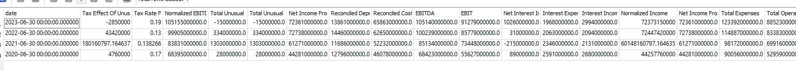
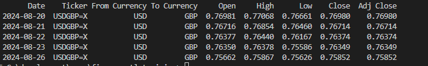
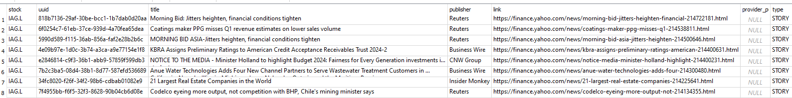

# cara_backend_etl
Backend ETL pipeline to process stock data from yahoo finance api


### Task 1
* 1. create main.py, extract_data.py, load_data.py
* 2. create requirments.txt file that has contents below
```
SQLAlchemy==1.4.52
yfinance==0.2.37
pandas>=1.3.0
```
* 3. run pip install -r requirements.txt
* 4. familiar yourself with  use yahoo finance api by looking at example here
    [Yahoo finance api example file](./samples/yahoo_finance_api_usage_example.py)
* 4. create two functions in extrac_data.py see below

```python
def get_stock_history(stock):
    '''this function should pull stock history given a stock input,
       please follow this link to get example on how to use yahoo finance api
       https://github.com/ranaroussi/yfinance
    '''


```
it should return a data frame like this below

<!--  -->


```python
def get_stock_financials(stock):
    '''this function should get share holders of a stock given a stock input,
       please follow this link to get example on how to use yahoo finance api
       https://github.com/ranaroussi/yfinance
    '''

```
it should return a data frame like this below




When creating functions, please add type hinting and doc string like below


### Task 2
```python
1. add a function called get_exchange_rate to extract_data.py so it can download fx rate for us
def get_exchange_rate(from_currency, to_currency, interval):


```
and output should look like below




```python
2. add a function called get_stock_currency_code so that we know what currency this stock belongs to
def get_stock_currency_code(stock):
    #hint look attribute in fast_info property

```

```python


3. add function called get_news to extract_data.py so we can get relevant news belongs to that company
def get_news(stock):
```
and output should look like below


